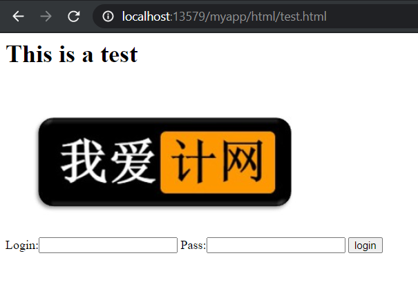

# Web App

A lightweight web server from the scratch, C++ and socket.

## Screenshot



## Features

- Not complex. Easy to understand.
- Well organized socket management.

## Build

> Environment requirement: Linux

First update the apt list:

```Bash
sudo apt-get update
```

Then, install essential tools like g++:

```Bash
sudo apt-get install build-essential
```

After installation, set `pwd` to the root folder of this project and run: 

```Bash
g++ -std=c++11 -g Server.cpp -o Server -pthread
```

Finally, run the file `Server` and browse `http://localhost:13579/myapp/html/test.html`
